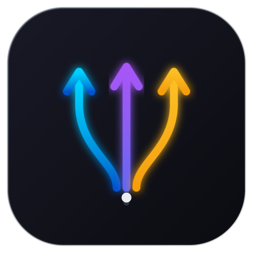
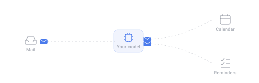
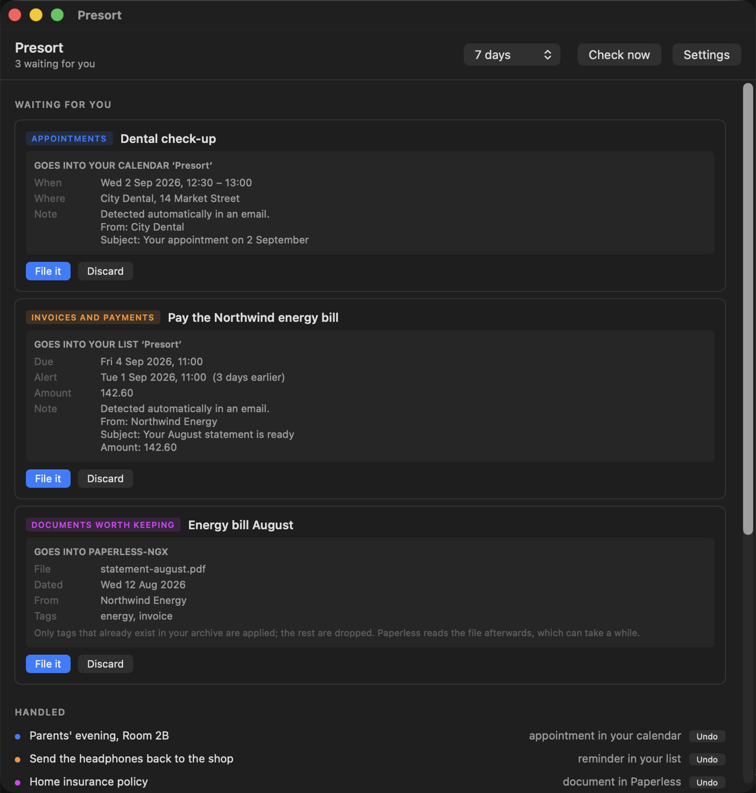
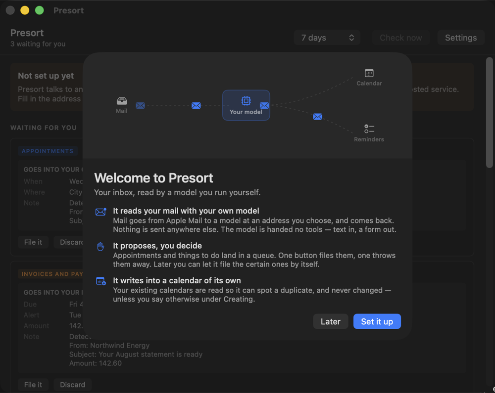

<p align="center">
  
</p>

# Presort

A small macOS app that reads your inbox with a language model **you** run, and turns
what it finds into calendar entries, reminders and filed documents.

<p align="center">
  
</p>

Everything lands in your mailbox and then nothing happens to it: the confirmation with a
date buried in the third paragraph, the invoice due on the fourth, the parcel that has to
go back before the eleventh. A language model is good at spotting those. Every product
that offers to do it wants a copy of your mailbox on their servers first.

This one doesn't. Mail comes out of Apple Mail, goes to a model at an address you choose,
and comes back. Nothing is sent to anyone.

## How it works

```
Apple Mail  ->  your model  ->  the app checks  ->  you approve  ->  its own calendar
                (no tools,       (title length,      (or let it        (never your
                 JSON only)       date sanity)        file itself)      existing ones)
```

**The model gets no tools.** It receives text and must answer with JSON in a fixed shape.
It cannot call anything, write anything or reach anything. An instruction hidden inside an
email can therefore produce a wrong form at worst, never an action.

**The app checks the answer instead of trusting it.** Titles must be 2–120 characters.
Dates must fall between roughly a month back and a year ahead. An appointment longer than
48 hours is refused. Whatever survives goes into a queue.

**It writes into a calendar and a reminder list of its own.** Your existing calendars are
read so it can spot a duplicate, and left alone. There is a switch to point it at a calendar
you already use, with the reason not to next to it.

Everything the app does happens on your Mac, with one exception you have to turn on
yourself: a **connection** to a service elsewhere. Paperless-ngx is the first, and it is
what a found document is handed to.

## What it looks for

Seven built-in categories, each a switch you can turn off, each with a description you can
rewrite in your own words:

| | | lands in |
|---|---|---|
| Appointments | somewhere you have to be, at a time | calendar |
| Things to do | something you have to act on | reminders |
| Invoices and payments | with the amount and the due date | reminders |
| Renewals and expiries | subscriptions, insurance, documents | reminders |
| Parcels to collect | waiting at a pick-up point | reminders |
| Travel and tickets | flights, trains, hotels, performances | calendar |
| Documents worth keeping | an attached invoice, statement, policy or ticket | Paperless-ngx |

A document only gets asked about when the message actually carries an attachment, and it
goes to Paperless with what the mail already says about it: the sender as correspondent,
the date printed on it, and a title. Tags are matched against ones that already exist in
your archive; none are invented.

You can add your own. What you **cannot** change is the JSON schema wrapped around your
description, because the validation above depends on its shape. The app shows you those
fixed parts, greyed out, above and below the box you type in.

Deadlines get a reminder a configurable number of days early (three by default) while
keeping the real date as the due date. A reminder that fires on the day a parcel must be
back is not much use.

## What it looks like

<p align="center">
  
</p>

Example data. Each card shows what will be written, not the fragment of mail it came from,
and each shape has a colour that follows it into the list of what has been handled.

<p align="center">
  
</p>

## Requirements

- macOS 14 or later
- Apple Mail, configured with the account you want scanned
- Any endpoint that speaks the OpenAI chat-completions shape: [Ollama](https://ollama.com)
  on the same Mac, a server on your network, or a hosted service if you would rather

## Building

No Xcode needed; the command line tools are enough.

```
./build.sh         # builds build/Presort.app
./test.sh          # runs the tests
```

The build is ad-hoc signed, which is enough to run it yourself. Distributing it to other
people needs a Developer ID and notarisation.

On first launch it will ask for access to Calendar, Reminders and Apple Mail. All three
are required: without them there is nothing to read and nowhere to write.

## Configuration

Everything lives in Settings, nothing in the source. Point it at your model (address,
model name, optional key), tell it which Mail account and mailbox to read, and choose how
far back to look. Nothing is scanned twice.

## Languages

The interface, the six descriptions and the prompt frame around your mail ship in English,
Dutch, French and German, and follow whatever language your Mac is set to. The French and
German translations have not been checked by a native speaker yet.

The language matters more than usual here, because the frame around your description is
also what tells the model which language to answer in — so a French Mac gets French
reminders, not translated ones.

The source, its comments and everything on GitHub are in English.

## Licence

[PolyForm Noncommercial 1.0.0](LICENSE.md).

Use it, change it, fork it and share it for any noncommercial purpose: personal use, study,
hobby projects, and use by charities, schools and public institutions. Selling it, or using
it as part of something you sell, is not covered. If that is what you want, ask.
